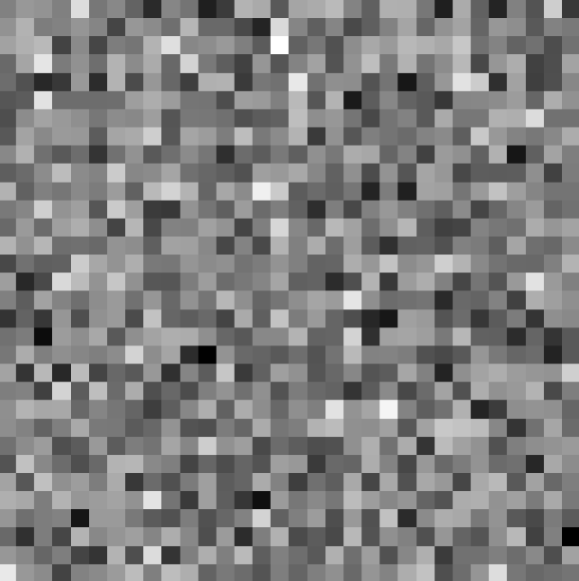
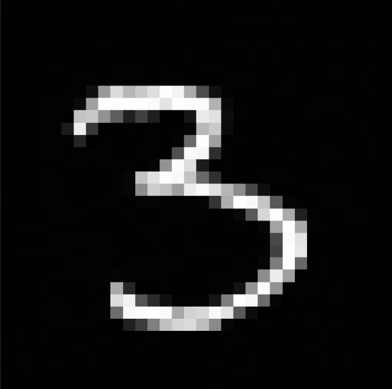
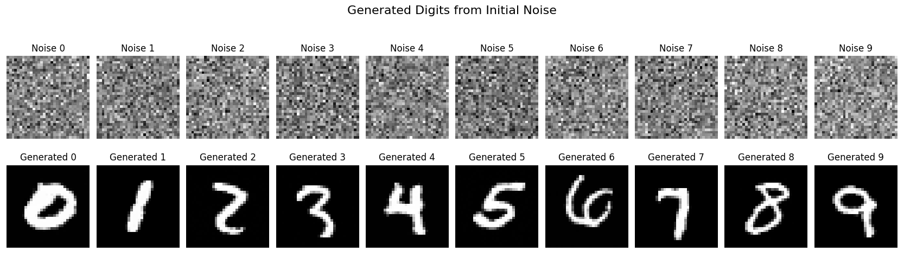
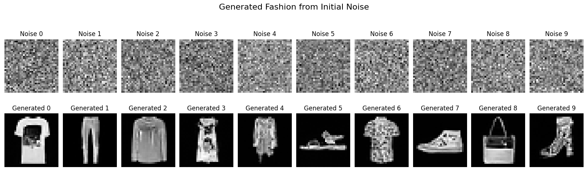
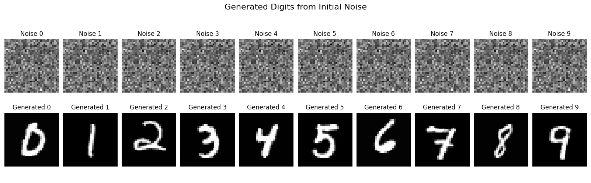

Title: Diffusion Models for MNIST Data
Date: 2025-09-27 18:22
Category: Machine Learning
Tags: machine learning, mnist

# Demo

[Before I even get started on what I've done, here is a demo that you can play with.](https://nathan-van-maastricht.github.io/diffusion_demo/)

# Introduction

After playing around with [reconstruction and classification of MNIST digits last week](learning-to-reconstruct-and-classify-mnist-digits.html) and talking to a few colleagues about the project, I decided to investigate diffusion models. I broadly knew what was happening within in them, they were removing noise from an image, slowly revealing the image that is actually desired. I didn't realise how close I was to already having a diffusion model though.

The goal of a diffusion model is to learn a process for a given dataset that can generate new elements that have a similar distribution to the original dataset. There are at least two other types of models that try to solve the problem of generating new elements in a dataset, one is GANs and the other is Normalising Flows. I'm not going to talk about GANs or Normalising Flows because I haven't actually implemented one, although I have taken inspiration from GANs in RL applications, which I might write about one day.

# Data

Similar to last week, I will be using the MNIST Digit dataset, but I have also added on the MNIST Fashion dataset. A small update on the reconstruction and classifying task, I did try it with the Fashion dataset, and it required a lot of tweaking, but I got quite good performance on that dataset too.

For this week though, I didn't do any preprocessing to attempt to improve performance, not even a translation of the image. I have kept the two datasets separate too, training two different models, one to handle the digits, one to handle the fashion images. Seeing as both datasets have the same number of classes though and image sizes, I just had to change the dataloader appropriately, all other code could remain the same.

I did do one preprocessing step that I don't believe affected the outcome - although I didn't do an ablation study - I added 2 pixels of black padding around the border to bring each image up to $32\times32$ pixels. My reasoning for this is the CIFAR-10 dataset is $32\times32$ pixels, and this modification will make it relatively easy to train on the CIFAR-10 dataset.

# Problem

So what is the actual problem I'm attempting to solve. Mostly I just want to learn about diffusion models. The approach we're taking to that problem is to generate images that are $32\times32$ of Gaussian noise, and then reconstruct a digit that a person would recognise as belonging to the digit or fashion datasets.

To give an idea of how hard this problem seems on the surface, this is a picture of random noise



and through a bunch of transforms on this image we are trying to end up with something like this



# Model

The model is technically of the form a Denoising Diffusion Probabilistic Model (DDPM) which was originally introduced in 2015. The implementation I have gone for is to keep a separate scheduler to manage the noise levels, and a U-Net to predict the noise.

## DDPM Scheduler

There are three core parameters, and a few derived parameters from those core parameters. They are used both in the training process and inference process.

1. $\beta$ is a linearly increasing sequence of variances, and I have relatively arbitrarily picked the lower bound to be 0.0001, and the upper bound to be 0.02. It is increased across all the time steps. This variable controls how much noise is added at each time step of the forward process.
2. $\alpha$ is derived from $\beta$'s, and is simply $1-\beta$
3. $\bar\alpha$ is the cumulative product of the $\alpha$ values, that is $$\bar\alpha_t=\prod_{i=1}^t\alpha_i.$$ This is another key component used to determine the total noise applied up to time step $t$ in the diffusion process.

I then precompute values such as $\sqrt{1-\bar\alpha_t}$ and $\sqrt{1/\alpha_t}$ which are used in both the forward process and the denoising process.

## U-Net

The U-Net model is responsible for predicting the noise that was added to a noisy image at a given time step $t$ and for a specific class label.

### Time Embedding

There is a time embedding that takes the time step $t$ and converts it into a high dimension vector using a sinusoidal positional encoding, and then uses a SiLU as an activation function. This embedding allows the model to determine where in the diffusion process it is. The time embedding is in a space with 256 dimensions.

### Label Embedding

I'm conditioning the model on a label, which in the case of MNIST digits or fashion is just an integer between 0 and 9. This is also partially why I haven't made a model combining both datasets, it's pure laziness not writing a function to transform the label for one of them. The actual embedding portion is quite small, just two layers with a SiLU activation. The label is embedded into a space with 256 dimensions.

### Combined Embedding

I then combine the time and label embedding by simply summing them. It is crucial that the two spaces have the same dimension because of this, and the space is large enough to be representative. 256 dimensions is probably overkill for this problem, but I have not experimented with making the space smaller yet.

### Resnet Block

The fundamental building block of the network is a resnet block. It has two convolutional layers with group normalisation and SiLU activation. It incorporates a residual connection within the block, in some cases it is a convulation layer, in other cases it is just the identity.

### Downsampling Path

The downsampling starts with a single convulation layer to increase the number of channels, then there are three resnet blocks with a max pool layer after each block to increase the number of channels and decrease the spatial dimensions.

### Bottleneck

A resnet block to make sure the downsampling path and upsampling path match.

### Upsampling Path

The path has three resnet blocks, with an upsample at the beginning of each block. There are skip connections from the corresponding level in the downsampling path through concatenation.

### Output

There is a final convolutional layer that is used to map back to the original 1 channel, which is then interpreted as the predicted noise.

### Layers

The following table shows how the parameters are distributed throughout the model. Hopefully the names are able to capture where in the model they are.

```
+-------------------------------+------------+
|            Modules            | Parameters |
+-------------------------------+------------+
| time_embedding.linear1.weight |   65536    |
|  time_embedding.linear1.bias  |    256     |
| time_embedding.linear2.weight |   65536    |
|  time_embedding.linear2.bias  |    256     |
|    label_embedding.0.weight   |    2560    |
|    label_embedding.2.weight   |   65536    |
|     label_embedding.2.bias    |    256     |
|        init_conv.weight       |    288     |
|         init_conv.bias        |     32     |
|       down1.conv1.weight      |    9216    |
|        down1.conv1.bias       |     32     |
|    down1.groupnorm1.weight    |     32     |
|     down1.groupnorm1.bias     |     32     |
|     down1.emb_proj.weight     |    8192    |
|      down1.emb_proj.bias      |     32     |
|       down1.conv2.weight      |    9216    |
|        down1.conv2.bias       |     32     |
|    down1.groupnorm2.weight    |     32     |
|     down1.groupnorm2.bias     |     32     |
|       down2.conv1.weight      |   18432    |
|        down2.conv1.bias       |     64     |
|    down2.groupnorm1.weight    |     64     |
|     down2.groupnorm1.bias     |     64     |
|     down2.emb_proj.weight     |   16384    |
|      down2.emb_proj.bias      |     64     |
|       down2.conv2.weight      |   36864    |
|        down2.conv2.bias       |     64     |
|    down2.groupnorm2.weight    |     64     |
|     down2.groupnorm2.bias     |     64     |
|     down2.skip_conv.weight    |    2048    |
|      down2.skip_conv.bias     |     64     |
|       down3.conv1.weight      |   73728    |
|        down3.conv1.bias       |    128     |
|    down3.groupnorm1.weight    |    128     |
|     down3.groupnorm1.bias     |    128     |
|     down3.emb_proj.weight     |   32768    |
|      down3.emb_proj.bias      |    128     |
|       down3.conv2.weight      |   147456   |
|        down3.conv2.bias       |    128     |
|    down3.groupnorm2.weight    |    128     |
|     down3.groupnorm2.bias     |    128     |
|     down3.skip_conv.weight    |    8192    |
|      down3.skip_conv.bias     |    128     |
|    bottleneck.conv1.weight    |   294912   |
|     bottleneck.conv1.bias     |    256     |
|  bottleneck.groupnorm1.weight |    256     |
|   bottleneck.groupnorm1.bias  |    256     |
|   bottleneck.emb_proj.weight  |   65536    |
|    bottleneck.emb_proj.bias   |    256     |
|    bottleneck.conv2.weight    |   589824   |
|     bottleneck.conv2.bias     |    256     |
|  bottleneck.groupnorm2.weight |    256     |
|   bottleneck.groupnorm2.bias  |    256     |
|  bottleneck.skip_conv.weight  |   32768    |
|   bottleneck.skip_conv.bias   |    256     |
|        up1.conv1.weight       |   442368   |
|         up1.conv1.bias        |    128     |
|     up1.groupnorm1.weight     |    128     |
|      up1.groupnorm1.bias      |    128     |
|      up1.emb_proj.weight      |   32768    |
|       up1.emb_proj.bias       |    128     |
|        up1.conv2.weight       |   147456   |
|         up1.conv2.bias        |    128     |
|     up1.groupnorm2.weight     |    128     |
|      up1.groupnorm2.bias      |    128     |
|      up1.skip_conv.weight     |   49152    |
|       up1.skip_conv.bias      |    128     |
|        up2.conv1.weight       |   110592   |
|         up2.conv1.bias        |     64     |
|     up2.groupnorm1.weight     |     64     |
|      up2.groupnorm1.bias      |     64     |
|      up2.emb_proj.weight      |   16384    |
|       up2.emb_proj.bias       |     64     |
|        up2.conv2.weight       |   36864    |
|         up2.conv2.bias        |     64     |
|     up2.groupnorm2.weight     |     64     |
|      up2.groupnorm2.bias      |     64     |
|      up2.skip_conv.weight     |   12288    |
|       up2.skip_conv.bias      |     64     |
|        up3.conv1.weight       |   27648    |
|         up3.conv1.bias        |     32     |
|     up3.groupnorm1.weight     |     32     |
|      up3.groupnorm1.bias      |     32     |
|      up3.emb_proj.weight      |    8192    |
|       up3.emb_proj.bias       |     32     |
|        up3.conv2.weight       |    9216    |
|         up3.conv2.bias        |     32     |
|     up3.groupnorm2.weight     |     32     |
|      up3.groupnorm2.bias      |     32     |
|      up3.skip_conv.weight     |    3072    |
|       up3.skip_conv.bias      |     32     |
|       output_conv.weight      |    288     |
|        output_conv.bias       |     1      |
+-------------------------------+------------+
Total Trainable Params: 2447681
```

# Training

The main idea of the training is to get the model to predict the noise that was added to an image at a randomly chosen time step.

First a random number is generated to represent the time step, between 0 and the maximum time step.

Then random noise is generated.

Using the $\bar\alpha$ values we can calculate the noisy image by $$\sqrt{\bar{\alpha}}\times C+\sqrt{1-\bar\alpha}\times N$$ where $C$ is the clean image, and $N$ is the noise.

This is is often called the "reparametrerisation trick" to make sure the sampling process is actually differentiable.

This noisy image, which time step, and the label are all passed to the model where it makes a prediction on the noise.

## Loss Function

The loss function is a simple mean squared error and is calculated between the predicted noise and the actual noise that was generated.

## Hyperparameters

Similar to my last post, I didn't do too much in the way of tweaking hyperparameters to make performance better. It worked with values I thought were relatively sensible far better than I would have expected.

- Learning rate: $5\times10^{-5}$
- Number of time steps: 1000
- Batch size: 64
- Optimiser: AdamW with pytorch default parameters other than learning rate

# Inference

The image generation phase starts with pure noise and runs the diffusion process in reverse, eventually getting to a clean image.

The process is an iterative Markov chain that starts at time step $t=T$ and ends at time step $t=0$.

We start with pure noise and keep track of the current image, the current timestamp, and the label the model is trying to produce an image for.

Within each iteration, the model makes a best prediction for the mean of the noise, and then a new mean is calculated from this prediction by $$\frac{1}{\sqrt{\alpha_t}}\times\left(I - \left(\frac{\beta_t}{\sqrt{1-\bar\alpha_t}}\right)\times N\right)$$

where $I$ is the original image at this time step, and $N$ is the predicted noise for $I$.

From this we get the image that is being fed into the next iteration by taking the precomputed posterior variance and scaling a Gaussian distribution by this variance, then adding it to the mean calculated in the previous step.

If we have stepped back to time $t=0$, then this new image is our output, otherwise we repeat the process again.

# Results

I didn't actually work on this too much. I did a bit of [reading](https://arxiv.org/pdf/2406.08929), and then dove right on in because I realised the model could be virtually the same as what I was already working on and thinking about.

I trained two different models, one for the digit dataset and one for the fashion dataset. The only difference between the two setups was the dataset being used, I didn't even tweak a hyperparameter. I started on the digits, and when that worked far better than I could have hoped, I decided to just try it on the fashion dataset without changing anything. In the reconstruction and classifying last week it didn't work great. I'll let the pictures speak for themselves this week though.

The following shows the 10 starting noise patterns, and the corresponding digits produced when conditioned on the appropriate label.



And similarly for the fashion model



One of the few ablations I actually did was to make sure the label actually mattered. I started with the same noise for each image generation, and only varied the labels. It is hard to see, but you can verify that the initial noise is the same for all images in the following output.



I think these images are all great for the amount of effort I put in.

# Future

A small thing of note that I initially wasn't doing is the conditioning on the label. I initially started without any conditioning, but then I obviously couldn't control which digit I was generating, which was a bit disappointing. I think it might be interesting to explore creating a secondary dataset where there are images representing 0-99 and see what can be made from that.

I also think CIFAR-10 is an interesting dataset in terms of challenges. I've spent the last few weeks playing around with a single channel image, whereas CIFAR-10 has three colour channels, which I'm sure has challenges I haven't had to solve yet.