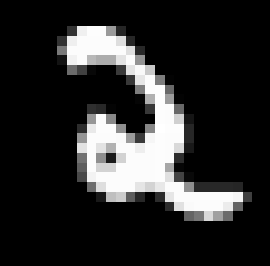
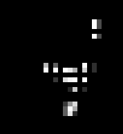
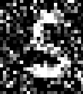
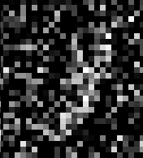
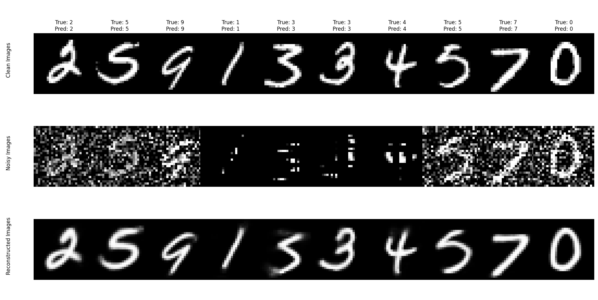

Title: Learning to Reconstruct and Classify MNIST Digits
Date: 2025-09-21 18:22
Category: Machine Learning
Tags: machine learning, mnist

# Introduction

This blog post is about my attempts to learn about self-supervised learning. Most of my background is in reinforcement learning as opposed to any kind of supervised learning, so I feel I need to broaden my knowledge and be aware of how to actually structure projects, issues that can arise throughout training, and how to adapt models. A relatively easy introductory project that I think covers both supervised and self-supervised learning is working with the MNIST Digits dataset.

# Data

The MNIST Digits dataset is a relatively old, and often considered easy, dataset. It contains 70,000 grayscale images of handwritten digits, 0 through 9, divided into 60,000 training images and 10,000 testing images. Each image is $28\times28$ pixels in size. Each image is correctly labelled.

# Problem

The primary goal is to distort the original images in some way, and then use a neural network to reconstruct the original image. This can lead down to more complex reconstruction problems of course, but this problem gives a very natural introduction to data reconstruction.

A secondary goal is to classify the image at an appropriate point in the pipeline.

As for tertiary goals, exploring more around data loading and processing, and differing types of models, as I tend to work with a lot of recurrent networks in my job, I don't get exposed too much to convolutional nets too often.

# Solution

The solution to the problem of both reconstruction and classifying is in roughly three stages, how do we process the data for training, what is the model architecture, and how is the model actually trained.

## Data Preprocessing

The following is an example of a raw $28\times28$ image (scaled up) from the MNIST dataset. The digit can appear anywhere within the image, at any size.



So the first natural distortion to make to the image is a translation. I took care to ensure that none of the non-zero values of the image left the view, that is the entire digit is still visible. I've been calling this translated image the "clean" image throughout my code, and is what the reconstructing network is going to try to reproduce.

The first true distortion that I apply is to zero out some rows and columns. I decided on 14 rows and 14 columns of the image empirically, too much less than that seemed far too easy for the network, and more than that made it too hard for me, and I didn't want to lose to a network. I've been, very creatively, calling this distortion "remove rows and columns". The following is an example of this type of distortion.



The second distortion I have applied adds some Gaussian noise with a mean of 0 and a standard deviation of 0.5 to the image, and then clamps the image to be back to grayscale, that is, if a number is less than 0, it is made to be 0, and if it is greater than 1, it is made to be 1. I personally find these images relatively easy to determine what the correct label is, so I wasn't particularly worried about being beaten by the network in these cases. I have been calling this distortion "clamping". The following is an example of this type of distortion.



The third and final distortion I have applied adds the same Gaussian noise, mean 0 and standard deviation of 0.5, but instead of immediately clamping it first takes the fractional part of it, then applies the clamping. This has the effect than positive numbers remain positive, and negative numbers go to 0. To give a few examples. If the original value in the image was 0.9, and then the Gaussian noise added was 0.2, the resulting pixel would have a value of 1.1, which is then translated to 0.1. So an almost white pixel gets mapped to an almost black pixel. On the other hand, if the pixel started off at 0.1, and a negative value was sampled from the Gaussian noise, such as -0.2, then the pixel value would be -0.1, which would get mapped to 0. I find this distortion to be much harder than the previous one to determine the original label, there is a good chance the model I have trained is better than me at this. I have been calling this type of distortion "fractional". The following is an example of this type of distortion.



To prepare the data for training, I make three copies of it. One copy is associated with each of the true distortions, and all three of them are associated with the translation distortion. Each time a sample is selected, a the translation is first applied, and that image is called the "clean" image, which is the one that is trying to be reconstructed. Then the "noisy" image is made by the appropriate distortion algorithm. The classification and reconstruction both are done from this noisy image.

## Model

I went through a few models, initially when I was just doing reconstruction I started with just an encoder/decoder approach, using three convolution layers in both the encoder and decoder, with a sigmoid after the decoder to ensure we were mapping to a grayscale image.

When I decided to try classifying as well, I used the same type of encoder as the reconstructor, then flattened the output from the encoder and sent it through two linear layers, with a logsoftmax as the output layer.

Both of these worked great by themselves, but I had the idea of trying to take advantage of the same encoder structure used for both models, and try to use some shared weights, which is something I haven't tried before.

So onto the model that I ended up going with

### Encoder

There are two blocks that feed into each other called "encoder1" and "encoder2", and then a block I call "bottleneck".

Encoder1 and encoder2 are identical in structure, but do have different parameter counts. They have the following structure:

1. Conv2d
2. Batchnorm2d
3. ReLU for an activation
4. Conv2d
5. Batchnorm2d
6. ReLU for an activation
7. MaxPool2d

And the bottleneck portion is basically the same too, except it doesn't have the maxpool2d layer.

Up until this point, all the parameters are shared by both the reconstructor and the classifier.

### Classifier Decoder

The classifier is relatively simple from this point. It starts by flattening the output from the bottleneck, and then passes it through three linear layers, finishing with a logsoftmax. That is

1. Flatten
2. Linear layer
3. ReLU
4. Linear layer
5. ReLU
6. Linear layer
7. logsoftmax

The logsoftmax is only due to the loss function I will be using through training, and in a world where this is a more high stakes project I would separate the logsoftmax out of the model itself so I am not committed to it post inference.

### Reconstructor Decoder

The reconstructor essentially undoes the encoder, with some residual  connections. There are two decoder blocks called "decoder1" and "decoder2", and a final "output" block. The two decoder blocks are identical in structure to each other, but once again with differing parameter counts again. The structure is 

1. ConvTranspose2d
2. ReLU
3. Conv2d
4. BatchNorm2d
5. ReLU
6. Conv2d
7. BatchNorm2d
8. ReLU

and the residual connection is into the first conv2d layer of each block. The first decoder block gets the output from the first encoder, and the second decoder block gets the original input, both through a concatenation of the tensors.

The output block is a simple:

1. Conv2d
2. Sigmoid

It's entire purpose is to just make sure the size of the output is correct, and the ensure the values are between 0 and 1. That is, we have a $28\times28$ grayscale image.

The following table shows how the roughly 2m parameters are distributed throughout the model. Roughly 75% of them are within the first layer of the classifier, so an obvious improvement would be to have a block that uses convolutions to step down to a smaller size first. But we're here now, so it's what we're doing.

```
+------------------------------+------------+
|           Modules            | Parameters |
+------------------------------+------------+
|      encoder1.0.weight       |    288     |
|       encoder1.0.bias        |     32     |
|      encoder1.1.weight       |     32     |
|       encoder1.1.bias        |     32     |
|      encoder1.3.weight       |    9216    |
|       encoder1.3.bias        |     32     |
|      encoder1.4.weight       |     32     |
|       encoder1.4.bias        |     32     |
|      encoder2.0.weight       |   18432    |
|       encoder2.0.bias        |     64     |
|      encoder2.1.weight       |     64     |
|       encoder2.1.bias        |     64     |
|      encoder2.3.weight       |   36864    |
|       encoder2.3.bias        |     64     |
|      encoder2.4.weight       |     64     |
|       encoder2.4.bias        |     64     |
|     bottleneck.0.weight      |   73728    |
|      bottleneck.0.bias       |    128     |
|     bottleneck.1.weight      |    128     |
|      bottleneck.1.bias       |    128     |
|     bottleneck.3.weight      |   147456   |
|      bottleneck.3.bias       |    128     |
|     bottleneck.4.weight      |    128     |
|      bottleneck.4.bias       |    128     |
|      decoder1.0.weight       |   32768    |
|       decoder1.0.bias        |     64     |
|      decoder1.2.weight       |   55296    |
|       decoder1.2.bias        |     64     |
|      decoder1.3.weight       |     64     |
|       decoder1.3.bias        |     64     |
|      decoder1.5.weight       |   36864    |
|       decoder1.5.bias        |     64     |
|      decoder1.6.weight       |     64     |
|       decoder1.6.bias        |     64     |
|      decoder2.0.weight       |    8192    |
|       decoder2.0.bias        |     32     |
|      decoder2.2.weight       |    9504    |
|       decoder2.2.bias        |     32     |
|      decoder2.3.weight       |     32     |
|       decoder2.3.bias        |     32     |
|      decoder2.5.weight       |    9216    |
|       decoder2.5.bias        |     32     |
|      decoder2.6.weight       |     32     |
|       decoder2.6.bias        |     32     |
|       output.0.weight        |     32     |
|        output.0.bias         |     1      |
| classification_head.1.weight |  1605632   |
|  classification_head.1.bias  |    256     |
| classification_head.3.weight |   16384    |
|  classification_head.3.bias  |     64     |
| classification_head.5.weight |    640     |
|  classification_head.5.bias  |     10     |
+------------------------------+------------+
Total Trainable Params: 2062859
```

## Training
Now that we have our model, we need to train it. The training was both easier and harder than I anticipated. I didn't do too much in the way of tweaking hyperparameters and will list what I ended up using later. The process broadly was to

1. Construct the dataset with the three different types of distortions and shuffle
2. Load the data in batches
    - Training batches were always shuffled
    - Testing batches were initially not shuffled as is standard, but for visualisations reasons I ended up shuffling them too
3. The model was passed the noisy images
4. Loss was calculated
5. Parameters updated

This process was conducted broadly around 25 epochs for a training run. I did do an overnight training run of 500 epochs, without too much improvement at test time. The data was constructed as is described earlier, and then loaded using a standard DataLoader object in pytorch. Most of the rest of the process is done in pretty much the standard way, with the only real interesting component of the training process being the loss calculation.

#### Loss Function

The classification and reconstruction requires two different loss functions.

The loss function I used for the classification was the negative log likelihood (NLL), which is why I have a logsoftmax in the output layer of the classifier.

The loss function I used for the reconstruction was mean squared error (MSE). There is an argument to be made that mean absolute error (MAE) could also be useful, and I just arbitrarily picked one. I haven't experimented with MAE yet, but I will at some point.

An issue I didn't consider before starting this project is the relative size of these two loss functions. Without any weighting, after the first epoch the NLL loss is on the order of $10^{-1}$, while the MSE is on the order of $10^{-2}$. The weighting between the two loss functions is one of the few hyperparameters I actually played around with a bit, and was the biggest complication to training in not an obscenely large number of epochs.

I initially started with the loss $$\mathfrak{L}=350\times\text{MSE}+\text{NLL}$$ for 10 epochs, and then lowered the coefficient of the MSE component to 275 for another 5 epochs, then to 125 for a further 5, then finally only 25 for the last 5 epochs, for a total of 25 epochs.

#### Hyperparameters

As I mentioned earlier, I didn't really investigate finding the optimal value for the hyperparameters, and just went with my gut after observing the losses and visualising the outputs of a handful of instances.

- Learning rate: $10^{-4}$
- Batch size: 64
- Optimiser: AdamW with pytorch default parameters other than learning rate
- All Gaussian random noise had a mean of 0 and a standard deviation of 0.5
- The number of rows and columns removed was always 14

# Results

I worked on this over three days, although most of that work was not active time, more waiting for the model to train, adjust something slightly, then go again. The actual coding time was a few hours.

To talk about the results, make sure you have in your mind how the model was structured, both the classification and reconstruction shared an encoder, and only then were they split up into separate components. If the classifier and reconstructor had different encoders they could become more specialised and do even better. I am very happy with the results given the relatively small amount of effort and optimisation I have put in.

## Classification

The classification results should be broken down in to three types

1. Classification on clean images
2. Classification on noisy images
3. Classification on reconstructed images

Recall that the model is trained on the noisy images, so the classifier has never seen a clean image, or a reconstructed image. It is easy to give a quantitative assessment for classification, what percent does it get correct on a held out test set. As mentioned, the MNIST digits have 10000 images held in the test set. The same setup as training is used for constructing the test set, it is duplicated three times, and each image is translated first, which is then called the "clean" image, then each of the three noises are applied to their appropriate portion of the set, with the result being called the "noisy" set. Then for classification, we can also feed back in the reconstructed images to classify too, so we also end up with a set called the "reconstructed" set.

1. Clean set classification accuracy: 99.53%
2. Noisy set classification accuracy: 97.52%
3. Reconstruction set classification accuracy: 96.77%

Given that this was a side quest on the primary purpose of the project, I am very happy with these results. I am particularly happy with the clean set classification given that it had never actually seen any of those images, and it was learning to classify from images that looked like


and


## Reconstruction

Reconstruction is harder to quantitatively measure. The loss went down, that's obviously going to happen though and doesn't prove anything. So here is a visual. The top row is the clean images (the originals and a translation). The second row is the images after the noise is applied. The third is the reconstructed images. The title of each column indicates what the true label was, and what the label from the classifier was from the noisy image. This data is from a random shuffle of the test set and has not been hand selected (more on this later).



Obviously the reconstructions aren't perfect, both 3's for example is reconstructed relatively poorly compared to the original image, but they both do still resemble a 3.

To play around with the model myself I exported the model using onnx and made a static page so I can just host it on a github page. Feel free to have a play around with that [here](https://nathan-van-maastricht.github.io/mnist_demo/). The first time you process the image, there is a small wait while the model is loaded, but after that it will perform quite quickly.

# Future Projects

As I mentioned in the data section, the MNIST digits are generally considered to be an easy dataset to work with, state of the art achieving a 0.09% error rate. The models that are achieving these error rates are more complex than what I am using, so there is room for expansion on that side of the project. Separating the encoder for the classifier out to allow it more specialisation than the joint problem of classifying and reconstruction would also allow it to work better. Having a better learning curriculum would also be advantageous, rather than going all or nothing on the distortions throughout training.

But something that is of more interest to me is a follow up dataset, also by MNIST, called Fashion MNIST. It also has 70,000 images that $28\times28$ grayscale of fashion products, split into the same 60,000 training, 10,000 testing sets. It has a much higher error rate at the high end, still with well over 1% error rates. So this will likely be the next ML project for me, especially given the relative ease of using this dataset with my current setup.