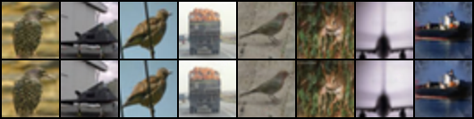

Title: Latent Diffusion Model on CIFAR-10
Date: 2026-01-07 13:20
Category: Machine Learning
Tags: machine learning, cifar, diffusion, VAE

# Project

This project builds a Latent Diffusion Model (LDM) on CIFAR-10 that has been upscaled to 64x64.

# Introduction

After exploring diffusion on [MNIST datasets](https://nathan-van-maastricht.github.io/Nathan-Van-Maastricht-blog/articles/2025/09/diffusion-models-for-mnist-data.html), I have continued exploring more, successfully building a LDM on CIFAR-10 data. This post covers the first phase of a currently three month project helping to expand my knowledge around diffusion models. I'm going to keep this post relatively high level, with details in upcoming posts as I'm still continuing to work on this project.

I'm going to describe the process I've gone through making a class conditioned latent diffusion model. I'm also going to drop the phrase "class conditioned" from now, but keep in mind that it is class conditioned, with classifier free guidance.

# Background

I'm going to use the word MNIST to refer to both the MNIST digit dataset and the MNIST fashion dataset. Both of them posed roughly the same problems as each other. They are both $1\times 28\times 28$ images. Because it's easier to work with powers of two, I did add a 2 pixel padding to each side of the image to bring them up to $1\times 32 \times 32$ to make it easier to mentally reason about various up and down sampling aspects. MNIST was only ever meant to be a proving ground though, and never the end goal.

Moving on from MNIST, I went to CIFAR-10, which I'm going to refer to as CIFAR. CIFAR has some aspects in common with the MNIST data as I transformed them. They are still $32\times 32$ in dimension, but they do have three colour channels, rather than being gray scale. There are still 10 classes too. Instead of being artificial such as the fashion dataset though, they are real images that have in most cases been downscaled. Within these images there is a lot of overlap. For example, both planes and boats often have blue backgrounds, horses and deer often have grassy fields involved, and dogs and cats are often indoors. Already this poses problems. To more closely approximate my end goal, I decided to upscale the images to $3\times 64\times 64$ and shifted to a latent diffusion model. Upscaling, just to compress this information back down is counter intuitive if the purpose was to just create the model, but the primary purpose is my learning. The end goal was still not the CIFAR dataset though, I want to at least get to using the full ImageNet-1k dataset, but this post will focus on the CIFAR work.

# Goal

The goal of this particular bit of work wasn't to produce super high quality images, it was to get to the point that I was confident I could train for longer and produce high quality images. It was a stepping stone, learning project, with the purpose of it to be sufficiently complex that it requires learning new techniques, but not so complex that I have to wait weeks for a training run to realise I failed.

# Models

As alluded to, there are three models that need to be trained for this project. A VAE, a discriminator, and a UNET. The VAE and discriminator are trained synchronously in a GAN setup, and the UNET is trained with a frozen VAE afterwards. The discriminator is only used in the VAE training, and is otherwise not used at inference time. The VAE is used to encoded the raw images into a smaller latent space, allowing the UNET to learn on this latent space, which allows for less resources in the UNET training phase. When applied to diffusion, this setup is called a Latent Diffusion Model (LDM).

## VAE-GAN

The purpose of the VAE is to take the $3\times 64\times 64$ image and compress it down into a $4\times 16\times 16$ latent space. The purpose of the GAN is to be used as a regularisation mechanism for the VAE. It's used in both the adverserial loss and for feature matching. A possible way to improve on this approach is to use a pretrained visual geometry group network for the feature matching, but that would be antithetical to the goal of learning for me. I want to train every model myself in the process. Only later will I consider using pretrained models in the process once I can start appreciating the difficulty of training those models and the purpose of those models.

The latent space the VAE produces should have some properties that are relatively nice for the UNET to be able to effectively learn. In an ideal world, the latents will have a mean of 0 and a standard deviation of 1. In practice I trained the VAE until it could produce over the entire training dataset a space that had a mean that was less than 0.001 and a standard deviation that was roughly 0.96.

## UNET

Unlike in the MNIST case where the UNET was operating over the image space, this time it is operating over the latent space produced by the VAE. At a high level, the purpose was still the same though, predict the noise in a tensor at a particular timestep through a stochastic process. At a slightly lower level, instead of predicting the noise directly instead a reparameterisation is done and I am instead predicting velocity. The purpose of this reparameterisation is stability, predicting the noise directly, especially at low time steps, can result in large loss values due to potential wild guesses when the signal to noise ratio is particularly low or high, destabilising training.

# Training

The training is in two stages, first the VAE and GAN are trained synchronously, then the VAE's weights are frozen and used to train the UNET. The CIFAR data is used in both the VAE-GAN training as well as the UNET training, but in different ways.

## VAE-GAN

The VAE and discriminator are adversarially trained, in a GAN structure.

The discriminator is attempting to distinguish real images and images that have been reconstructed by the VAE.

The VAE has a much more complex job, it is trying to reconstruct images, while keeping the mean and standard deviation of the latent vectors to be closer to 0 and 1 respectively. Because of these two competing objectives, a common downside to this objective is blurry images, which can be alleviated by using the discriminator in two ways. The first is just a penalty for how well the discriminator is doing, the second is using the features the discriminator is learning, and use this for a feature matching component of the loss function.

Given that there are four objectives of the VAE now, there are multiple failure points. The typical GAN mode collapse of course, or the VAE or discriminator learning much faster than the other. We could also have the KL divergence go to 0 which would likely indicate posterior collapse.

The learning rate for the VAE used a cosine annealing schedule, starting at $8\times 10^{-4}$, with a minimum value of $1\times 10^{-7}$. The discriminator similarly decayed with a cosine annealing schedule, but with a starting learning rate of $2.4\times 10^{-3}$, with a minimum value of $1\times 10^{-6}$.

The loss function was a linear combination of the four objectives, with the weighting of the KL divergence and adversarial loss being warmed up. The weighting of the reconstruction loss was roughly 65% of the total final loss rest being relatively uniformly distributed.

I capped the VAE-GAN training at 300 epochs, with a batchsize of 128, and the dataloader dropped the final smaller batch each epoch, so there were roughly 117000 weight updates. Continuing training at this point would likely have resulted in a higher quality latent space, but the time investment was not something I was interested in spending given my current goal of working on a much larger dataset and image resolution, so I decided this was sufficient to tell if the UNET was going to train well enough.

## UNET

The UNET trains by using a frozen copy of the VAE to first encode each image in the dataset down to a mean and logvar, which is then used to sample latents representing the original image. The target latents are created with noise with respect to a cosine schedule to create the v targets for the v prediction objective.

# Bottlenecks for LDMs

Moving from an image space diffusion model used on the MNIST data to processing images that are four times the spatial dimensions, as well as moving to three colour channels posed processing speed problems. To solve this I have introduced two additional models that need to be trained into the training process, which adds both time and complexity to the process, making it harder to find where issues arise. There's also just more data to process, which makes the per epoch time longer.

## Processing Resources

Due to the larger size of the images, both more compute and more VRAM were required. The VRAM issue is what lead to the LDM for me. Having smaller representations of the images meant I could use the same batch size as I did in the case of MNIST, but for images that contained 12 times more data in CIFAR.

As for the compute limitations, I used the same GPU setup, I have access to a single 4070. For training the VAE-GAN, my initial implementation took roughly 2.5 minutes for each epoch. The UNET took roughly 1.5 minutes per epoch in the initial implementation.

So I explored different ways to improve this time. I ended up with a dataloader that had 8 workers, with a prefetch factor of 4, and I allowed persistent works. I used mixed precision, going between 32 bit floats and torch's bfloat16 when possible. I compiled all the models with just the default torch parameters. I allowed the float32 matmul precision to be "high", allowing for bfloat16 calculations internally too.

I also just refactored the code eventually, removing a large amount of redundant calculation in particular for both training runs. For the UNET training, instead of encoding the image each epoch, I precomputed the mean and logvar and loaded just that, sampling from that, which saved significant time and VRAM, completely removing the VAE from the training loop.

## Logging

While obvious, logging is important. Up until this point I had hadn't exactly had good practices around logging various metrics. But I also didn't really need to because training was so short on the smaller dataset. I finally introduced logging to my training loops, keeping track of various metrics. In the future I'll likely add tensorboard visualisations as well. I've used tensorboard in the past and it's useful, but it's felt like overkill up until this point.

## VAE Training

The VAE training was precarious. Given that there are four competiting objectives they had to be balanced appropriately. Given I wasn't after perfect images at the end of the process I decided that 300 epochs should be enough for the UNET to at least have a chance of learning the latent space, and I could always go back and give it more training if required anyway. I emperically picked values for warmup on the KL divergence coefficient, allowing the VAE to first learn to reconstruct a little bit before having it represent the latents properly. Without this warmup, it seemed to struggle to learn. I also had a warmup on the adversarial loss to let the discriminator get a bit ahead of the VAE. It seemed easier for the VAE to catch up to the discriminator than the other way around. It also seemed useful to start the discriminator off at a higher learning rate than the VAE, as well as finishing it's schedule at a higher learning rate than the VAE.

## Sampling

This was the first time I trained a model for v prediction rather than noise prediction, and combined with mixed precision made for some interesting problems. I didn't watch the variables continuously, but there was potentially underflow issues, especially near the start and end of the cosine schedule, which resulted in a few failed attempts at sampling initially.

Having only trained noise prediction models before, it was relatively obvious when the model was learning, as opposed to v prediction models, where the visual learning signals seem to be different. A small coloured dot on a solid coloured background is a good signal early in training for example.

## Stability

The reason to swap to v prediction in the first place was stability. It has a smoother learning curve than for noise prediction, although a slightly harder implementation and additional compute associated with it. On top of v prediction, clipping the gradients to have a norm of 1.0 proved useful as well, especially early on when the learning rate was high.

# Results

## VAE-GAN

The VAE-GAN was trained for 300 epochs. The VAE ended up with fantastic reconstruction, with a MSE of roughly 0.01 compared with the ground truth image. The KL divergence was just below 1.0, so we didn't get collapse, but do have a pretty good space. The discriminator loss was roughly 0.66, which is right on the expected value for a confused discriminator. Overall, I'm very happy with the VAE after this training, although I could have had marginal improvements if I doubled the training time.

This is an example of the VAE's reconstruction after 300 epochs. The top row is the original image, and the bottom row is the reconstruction by the VAE.

## UNET

The UNET was trained for 750 epochs. The UNET likewise did alright, with a MSE on the v prediction compared with v target over the latent space of roughly 0.3. Given the VAE could have been trained more, I'm more than happy with this. Sampling for 50 time steps with a classifier free guidance scale of 5.0 gives images that are recognisable as their label. Due to the upscaling of the original dataset, there is plenty of blur on these images, and the model is still confused with cats and dogs, especially their faces. Horses started to appear early in the training compared to the other classes, and boats and planes followed soon after.

This is the result after the 750 training examples, and while I'm not thrilled with it, it did give me the confidence that I'm on the correct path and I'm calling the project a success. These images are all from the diffusion model, not from the original dataset.

# Future Work

The purpose of this entire project was a stepping stone to a larger project. I'm already in the process of swapping to a larger dataset, ImageNet-1k, as well as higher resolution images, 256x256, rather than 64x64. I will continue to use the same model setup at a high level, although will need to tweak hyperparameters almost surely. But that is the next goal, have a large dataset with more variety.

To lend some credence to the idea that I was on the right track, here's an image from my next project, which of course I will write about too. While these images aren't perfect either, I'm also thinking of the next project as a stepping stone as well, but more about that later!

