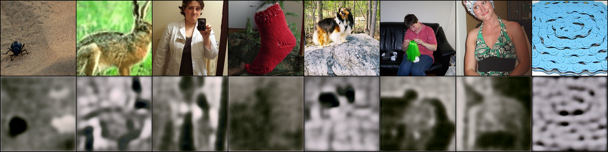
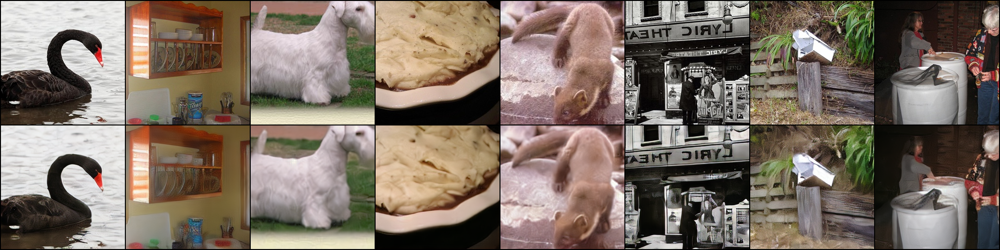
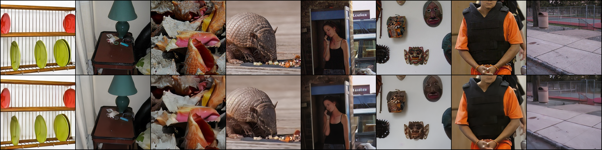
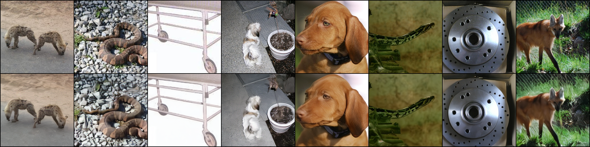

Title: ImageNet-1k Latent Diffusion Model (Part 1: The VAE)
Date: 2026-03-02 21:03
Category: Machine Learning
Tags: machine learning, imagenet, diffusion, VAE

# Introduction

This post is the first of two about how I've trained a Latent Diffusion Model (LDM) to generate images from ImageNet-1k class labels.

As a recap from the last post, which was a [high level overview](/articles/2026/01/latent-diffusion-model-on-cifar-10.html) of how a LDM works we have two main components:

1. A Variational Autoencoder (VAE) to compress images into a latent space
2. A diffusion model that takes a noisy latent and either directly or indirectly removes the noise

This post is going to focus on the VAE component. It is often overshadowed by the diffusion process itself, but the VAE is the foundation; it determines the upper bound of the quality of the generative process.

The goal of the VAE in this project is to compress the images into a latent space that is feasible to train a diffusion model on. Specifically, I am taking RGB images which have shape $3 \times 256 \times 256$ (196,608 features) down to a latent representation of $4 \times 32 \times 32$ (4,096 features). This is a $48$x reduction in dimensionality, which moves us into the realm of tractability for the reverse diffusion process.

For the downstream reverse diffusion process, we do need the latent space generated by this VAE to have nice properties, so to that end we are going to use a GAN approach to regularise the loss.

Due to the hardware I have easily available to me that fits my budget, I needed to employee gradient accumulation throughout the training process. I have noted a handful of cases where this has affected decisions made.

# Architecture

The architecture follows a symmetric encoder-decoder design, centred around a bottleneck that handles the heavy lifting of spatial compression. The Encoder's job is to progressively reduce the spatial resolution of the $256\times 256$ input, while increasing the feature depth, leading to the $32\times 32$ latent space. The Decoder mirrors this process, using the latent features to calculate the high-frequency details required to reconstruct the original image. The model largely relies on a series of Residual Blocks for feature extraction, and a central Attention Block to capture global context at the highest level of abstraction.

For both the encoder and decoder, a common strategy is to initialise the final convolution layers to have zero weight and bias, essentially allowing for a pseudo-identity mapping to prevent initial random noise from causing large gradients, allowing the model to develop smoothly.

This image is the first image produced after an update of the weights. The top row is the ground truth image, and the bottom row is the reconstruction produced by the VAE. This will hold throughout all of the images, the top row is the ground truth and the bottom is the reconstruction.



## Residual Blocks & GroupNorm

At the heart of both the encoder and decoder are Residual Blocks. These allow the network to learn additive updates to the feature maps, which is essential for preserving signal integrity across many convolution layers, without them the gradient signal would likely degrade significantly before reaching the earliest layers of the encoder.

In my implementation, I opted for a "Pre-Activation" style layout, where the normalisation and activation occur before the convolution:

```python
self.norm1 = nn.GroupNorm(32, in_channels)
self.act = nn.SiLU(inplace=True)
self.conv1 = nn.Conv2d(in_channels, out_channels, kernel_size=3, padding=1)
```

`BatchNorm` is a common default, but it relies on the statistics of the entire batch. Because I'm using Gradient Accumulation to reach a larger batch size than can fit into my available VRAM, I decided that `GroupNorm` was the more appropriate choice as `BatchNorm` can become unstable with small batch sizes. 

`GroupNorm` however will divide the channels into 32 groups in this case, and calculate the mean and variance within those groups per sample instead, which is batch size invariant. This makes the training stable, which is definitely helpful for making a high quality VAE.

I chose SiLU (also called Swish) as an activation function. It is defined as 

$$f(x)=(x\times\sigma(x))=\frac{x}{1+e^{-x}}$$

Unlike ReLU, which has a hard zero floor that can lead to dead parameters, SiLU is smooth and non-monotonic. This continuously differentiable nature tends to help the optimiser find better minima in the complex loss landscape that we will eventually construct.

The key feature making a Residual Block a Residual Block is the shortcut connection. When the input and output channels are identical, the shortcut is just the identity map, allowing the gradient to pass through unimpeded.

However, as the Encoder increases feature depth, a simple addition across vectors is impossible due to their differing lengths. To handle this I used a learnable shortcut using a $1\times 1$ convolution:

```python
if in_channels != out_channels:
    self.shortcut = nn.Conv2d(in_channels, out_channels, kernel_size=1)
else:
    self.shortcut = nn.Identity()
```

This ensure that even when changing the shape of the data we maintain the fundamental residual logic.

## Attention Bottleneck

The Residual Blocks are fantastic at extracting local features such as textures and edges, they are limited by the size of their convolutional kernels. Even with many layers a convolution still only has a finite receptive field. To generate coherent images, especially more complex images from ImageNet (and future datasets I have posts in the pipeline on), the model needs a way to understand the global context too.

To resolve this issue I included an Attention Block in both the encoder and decoder at the smallest spatial resolution. At this point in the network the image is only $32\times 32$ pixels, so we can easily afford the quadratic costs of Self-Attention.

By placing attention at the deepest part of the architecture, we allow every pixel in the latent representation to attend to every other pixel, regardless of their spatial distance. This helps the VAE maintain structural consistency, for instance ensuring that if the model is reconstructing a cat, the tail and head are placed logically relative to each other.

For the scaled dot-product attention I opted for PyTorch's optimised `scaled_dot_product_attention`, which is memory efficient and fast. The maths follows the standard Transformer approach: $$\text{Attention}(Q, K, V)=\text{softmax}\left(\frac{QK^T}{\sqrt{d_k}}\right)V$$

The term $\frac{1}{\sqrt{d_k}}$ is the scaling term. As the dimensionality of the hidden states ($d_k$) increases, the magnitude of the dot products tends to grow. Without this scaling, the values entering the softmax would be extremely large, pushing the function into regions where the gradients are nearly zero. This small constant keeps the attention mechanism stable during the early, high variance stages of the training.

In the code, this is handled by projecting the input into Query ($Q$), Key ($K$), and Value ($V$) tensors using $1\times 1$ convolutions, performing the attention operation, and then projecting back to the original channel dimension. This ensures that the block only adds necessary global information without destroying the local features already learned by the preceding residual layers.

# Adversarial Training & Feature Matching

While a standard VAE trained on Mean Squared Error (MSE) or L1 loss can reconstruct the general shape and colour of an image, it almost always results in blurry outputs. This happens because pixel-wise losses represent a mean of all possible reconstructions, and the model learns to "play it safe" by averaging out high frequency details like fur, grass, and fabric textures. This is especially noticeable in faces due to how well we perceive other peoples faces.

To overcome this though, I used an Adversarial Training strategy. I introduced a second network, a discriminator, to force the VAE (acting as the generator) to produce images that are not only measured on their pixel accuracy, but also their perceptual quality, according to the discriminator.

## PatchGAN Discriminator

Rather than using a standard GAN discriminator that looks at the entire image and outputs a single "real or fake" scalar, I implemented a PatchGAN architecture.

In the discriminator I used a LeakyReLU  for all activations. This is a good choice for discriminators because it provides a small, non-zero gradient for negative values, rather than a zero gradient. This prevents dead regions in the discriminator, ensuring it can always provide a useful signal to the VAE, even when it is very confident that an image is fake.

The component that gives PatchGAN it's name is the final layer

```python
self.output_conv = nn.Conv2d(curr_ch, 1, kernel_size=3, stride=1, padding=1)
```

Instead of a fully connected layer at the end, this convolution outputs a 2D grid of values. Each pixel in this output grid corresponds to a specific $N\times N$ patch in the original input image. This $N\times N$ area is known as the Effective Receptive Field (ERF).

Because the discriminator is composed of several strided convolutions, each unit in the final output map is exposed to a specific window of the input image. In this case, the discriminator isn't answering the question "is this image a dog?" but instead asking something akin to "does this specific $70\times 70$ patch look like a real ImageNet texture?"

By focusing on local patches, we the VAE is forced to prioritise high-frequency details, local textures, sharp edges, and fine patterns, which are exactly the things MSE and L1 loss tends to smooth over. This makes the adversarial loss much more stable and easier to train than a global GAN, as the discriminator is effectively providing a spatially aware loss map back to the VAE.

# Loss Landscape

Training a high-fidelity VAE is a balancing act. We are trying to minimise a composite loss function that looks like

$$L_{total}=L_{pixel}+\lambda_{kl}L_{kl}+\lambda_{adv}L_{adv}+\lambda_{fm}L_{fm}$$

where the $\lambda$ parameters are weightings for the various loss terms:
- KL-Divergence
- Adversarial
- Feature matching

with the pixel loss having a coefficient of $1$, with the other parameters scaled appropriately.

Each term serves a distinct purpose, ensuring basic structural accuracy, forcing the model to generate realistic textures, and creating a latent space that is actually usable downstream.

## Pixel Reconstruction

I use a combination of L1 and MSE loss

```python
pixel_loss = (1 - l1_weight) * mse_loss + l1_weight * l1_loss
```

L1 loss is generally better at preserving edges and distinct boundaries, while MSE helps with global colour convergence and smoothing, as well as punishing big outliers early on in training. By weighting them together, with a heavy bias towards L1, we get the best of both worlds, structural integrity and a sharp boundary.

## ELBO and KL-Divergence

To ensure the latent space follows a distribution that the diffusion model can actually sample from, we need the Kullback-Leibler (KL) Divergence. This term regularises the latent space toward a standard normal distribution $\mathcal{N}(0,1)$.

The loss is calculated using the mean ($\mu$) and the log-variance ($\log(\sigma^2)$) produced by the encoder:

$$L_{kl}=-\frac{1}{2}\sum(1+\log(\sigma^2)-\mu^2-\exp(\log(\sigma^2)))$$

In practice I clamped the log-variance to be between -20.0 and 20.0 to prevent an exploding gradient problem, where the model tries to push the variance to near-zero or infinity.

The following reconstruction was produced just as the KL weighting reached a maximum in the loss function.



## Adversarial Loss

The adversarial loss is the driving force for the VAE to satisfy the discriminator's PatchGAN requirements. Unlike the pixel or KL losses, which have fixed targets, the adversarial loss is dynamic. That is, the target is constantly moving as the discriminator gets better at spotting fakes.

I used binary cross-entropy with logits in this case, although a Hinge Loss has proved better in later VAEs that I have trained too. In the training loop, the VAE's goal is to generate images that the discriminator determines are real images. The loss is implemented as

```python
adv_loss = F.binary_cross_entropy_with_logits(
        discriminator_reconstruction,
        torch.ones_like(discriminator_reconstruction),
    )
```

By setting the target to `ones_like`, we calculate the distance between the discriminator's current assessment of the reconstructed image and a perfect "real" score. This creates the gradient signal that pushes the decoder to generate more realistic, high-frequency textures.

The following reconstruction was produced just as the KL weighting reached a maximum in the loss function.



## Feature Matching

Finally, we have the feature matching loss. This is capturing perceptual quality by comparing the internal representations of the discriminator. By forcing the VAE's output to create the same feature maps in the discriminator as the real image I'm ensuring that the concepts are being reconstructed correctly at multiple levels of abstraction.

# Training

Training on ImageNet-1k is a relatively large undertaking on consumer hardware. Firstly, it's well over 100gb of images, with a preprocessing pipeline to actually load the data. But then, there are also just a lot of images, so I crafted different scheduling strategies.

## Warmup strategies

If the KL loss or Adversarial loss is applied at full strength from the first weight update the model will almost certainly enter a fail state. The encoder might simply learn to output zeros to satisfy the KL loss before it has even learned any pixel reconstruction, especially given the initialisation of our output convolutional layers.

To prevent this I used a simple linear warmup for both the KL and Adversarial weights.

- KL Warmup: roughly 20% of training steps
- Adversarial Warmup: 40% of training steps

By scaling these weights linearly, the VAE was first allowed to learn basic reconstructions through pixel-wise loss. Only once it had started to develop reconstructions was the pressure from the other losses enough to start shaping the latent space and improving the reconstruction. Notably, the KL warmup is shorter than the Adversarial warmup because I wanted the latent space to start forming structure before we started filling in the details.

## Learning Rate

For the optimiser I used AdamW with a learning rate of $10^{-4}$ for the VAE and a slightly more aggressive rate of $3\times 10^{-4}$ for the discriminator. The discriminator has less capacity than the VAE, so allowing it to update faster seems to prove effective. To manage the learning rates I used a cosine annealing schedule, decaying over the entire training run down to $10^{-7}$ for both models.

The purpose of the cosine annealing schedule is to start with a relatively high learning rate to quickly move around the loss landscape, and then smoothly move towards a local minimum. This decay makes the GAN dynamic much more viable, as the discriminator develops more techniques to determine real and reconstructed images apart, the VAE needs to make finer, more stable adjustments to avoid oscillating between a handful of modes.

## No EMA

A notable decision in this training run was the choice to NOT use an Exponential Moving Average (EMA) for the VAE weights. While EMA is a staple for the diffusion part of the pipeline, I found it unnecessary for the VAE.

The primary reason is the VAE is essentially a deterministic mapping. Unlike diffusion, where we are sampling from a high-variance noise distribution, the VAE needs to be much sharper. I found the cosine annealing schedule helped the raw weights of the VAE converge to a high quality state in small training runs, and an EMA tended to produce blurred outputs instead.

# Optimisations

Scaling a model to ImageNet-1k on a single GPU requires more than just a good architecture, it required using modern PyTorch features to maximise throughput and minimise memory overhead, and a decent amount of memory management to not fragment the VRAM and end up silently crashing.

## Mixed Precision & Compilation

I used `bfloat16` under an Automatic Mixed Precision (AMP) context. Unlike `float16`, `bfloat16` maintains the same dynamic range as `float32`, which is essential for the stability of VAEs. It prevents the KL loss from underflowing to zero, or the log-variances from overflowing without the need for constant loss scaling, which is the old approach.

Additionally I made use of `torch.compile` for both the VAE and Discriminator. This fuses kernels together and reduces the overhead of the Python interpreter, resulting in a significant speedup in the training loop, especially given the many small operations within the residual blocks. This meant I could stay in the world of python and not enter the world of c++.

The model quite naturally allowed for the full compute graph to be fused without any graph breaks. To ensure this was always the case, I did drop the last batch in the dataloader so the batch size was always consistent, otherwise there would be a graph break.

## Gradient Accumulation

Even with mixed precision, a batch size large enough to stablise a GAN was not feasible due to VRAM constraints. To solve this I used Gradient Accumulation.

I used a minibatch size of 8, and performed 16 backward steps before updating the weights. Because the gradients are additive, the loss for each minibatch must be scaled by the number of accumulation steps:

$$Loss_{\text{scaled}}=\frac{\text{Loss}}{N_\text{steps}}$$

This allowed me to simulate a stable batch size of 128 while only ever holding the memory for 8 images at a time.

# Design Constraints & Alternatives

In any machine learning project there are trade-offs between performance, compute, and the specific goals of the practitioner. While this VAE is robust, there are several common techniques I intentionally chose to omit.

## Pre-trained Perceptual Models (VGG/LPIPS)

Most modern VAEs for diffusion use a pretrained VGG network to calculate a Perceptual Loss. This effectively uses a frozen expert to tell the VAE if the reconstruction looks like a real object.

I chose to rely entirely on the Feature Matching loss from my own evolving discriminator instead. While using a pre-trained model might have led to a faster convergence, I wanted the experience of training the entire system from scratch. Relying on a self-supervised GAN objective meant I had to balance the generator and discriminator myself, which provided a much deeper understanding of the adversarial dynamics at play.

## Vector Quantisation (VQ-VAE)

Another popular alternative is to use a discrete latent space, where the encoder outputs indices into a codebook of vectors. While VQ-VAEs can be very stable, they introduce the complexity of codebook collapse and require specific strategies like EMA or commitment losses to keep the dictionary healthy. For this project, a continuous latent space with a KL penalty provided a more straightforward path to the downstream Flow Matching process.

I have already started working on my next project though, which uses a FSQ-VAE instead of this KL-VAE.

## Larger Latent Dimensions

I settled on a latent shape of $4\times 32\times 32$. Increasing the channel dimensions to 8 or even 16 would allow the VAE to capture even more nuance, but at the cost of significantly increasing the VRAM requirements for the Diffusion Transformer. This 48x compression ratio was the sweet spot for training on a single consumer grade GPU. This is also not the final form of this project, as I alluded to in the previous section, so decent is good enough for now!

# Conclusion

The VAE is the unsung hero of the LDM pipeline. By combining a residual architecture with an attention driven bottleneck, and regularising it with a PatchGAN discriminator, I've created a model that can compress the complex diversity of ImageNet-1k into a compact $4\times 32\times 32$ latent space without losing the perceptual fidelity.

With this foundation laid, the images are now ready to be converted into latents. In the next post, I'll write about how to train a Diffusion Transformer (DiT) to navigate this latent space using Flow Matching.

And finally, this is the output after training the VAE for 130,110 parameter updates. It could easily have gone for another 100,000 updates and likely still improve, but that's for the next project!

