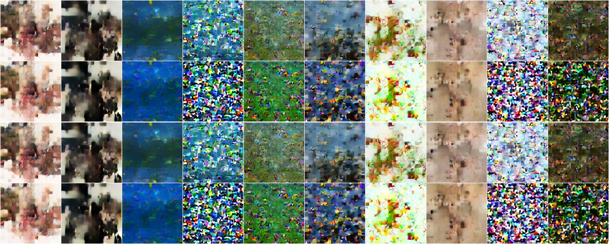
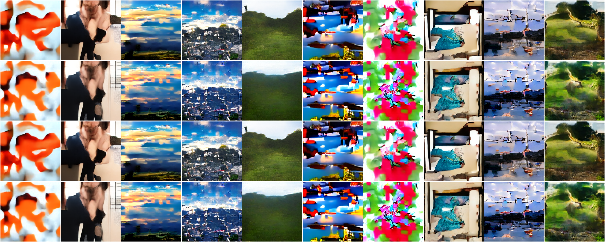
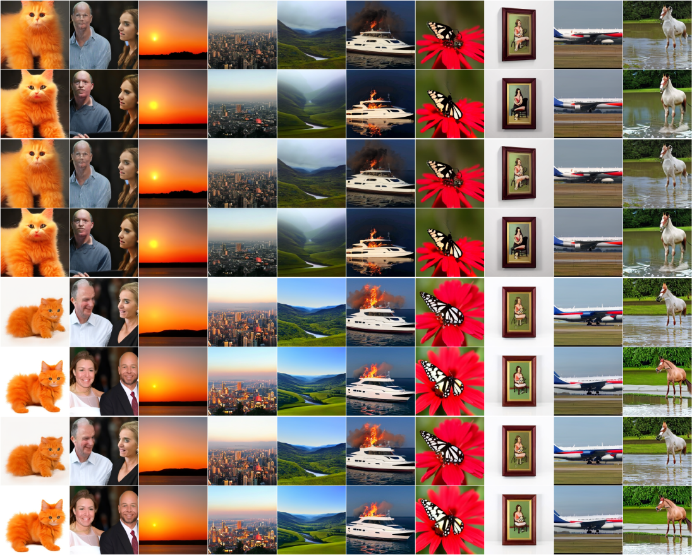

Title: The Complexity of building a Flow Matching Model for fun
Date: 2026-06-13 21:03
Category: Machine Learning
Tags: thoughts, projects, scaling

# Introduction

This post is a reflection on how my learning has been going for the last 9 months or so, where I have built a text2image diffusion model on nothing but the core PyTorch using just a Nvidia 4070. I didn't use any fancy libraries like Transformers. Using only basic PyTorch functions like Linear and Conv2d, I built up models that had many decision points, incorporating ideas from back in 2017, all the way to modern 2026 ideas.

I have taken a deeper dive into machine learning than I thought I was going to when I set out to learn a little bit about self supervised learning. It all started from trying to reconstruct MNIST digits from a noisy image though, which in hindsight was a much simpler task, but does also align quite strongly with some aspects of what I work on professionally now.

There's been far more decision points in this than I can remember, let alone write about, and my first point of reflection is I wish I took better notes on the progress, even in the early stages when it was a simple learning exercise, rather than something that caused me a lot of stress by the end of what I'm going to call version 1 of the diffusion model.

# What were my goals?

At the beginning of this project, around September 2025, I had mostly only had exposure to reinforcement learning. My undergraduate was in mathematics, with both a pure and applied major. I enjoyed the pure courses much more than the applied courses, although did really enjoy linear programming. Every course I could take for an elective was something in software engineering as I had enjoyed learning about programming throughout high school, and it was my second choice after mathematics. I was in the academic sphere for a while, starting and eventually stopping a masters degree in graph theory, but also taught and became friends with a few academics, eventually leading to lecturing and consulting positions. This led me to leave the academic sphere and (with a detour into cheffing) enter the industry.

I was more or less immediately thrust into a difficult, well studied problem, find a way to come up with high quality solutions to the TSP, quickly. This led down to learning about RL, and for well over a year it was my major exposure to machine learning. I've wrote a [previous post about how I approach this problem, leaving out some secret sauce of course](../../../articles/2025/11/travelling_salesman_problem.md). But this is where I sat at the the beginning of the project.

My primary purpose was to learn about self supervised learning. So I picked the easiest dataset that exists and started masking it out in various ways. It quickly became a trivial problem, so I wanted to push myself and started to play around with other datasets. Eventually I realised I wanted to learn about diffusion models because they seem relevant. So I'll list my goals, but they weren't all there at the beginning, the list will be in chronological order of when they were added:

1. Learn about self supervised learning on MNIST digits
2. Can I do diffusion on MNIST digits in pixel space?
3. Can I do diffusion on CIFAR-10 in pixel space?
4. Can I scale up CIFAR-10 to be 64x64 and do diffusion on those pixels?
5. Can I make a latent diffusion model for ImageNet-1k?
6. Can I make a latent diffusion model with text conditioning rather than class conditioning?

# What did I actually do?

## Self Supervised MNIST Digits

For the MNIST digits, for the most part I was doing image infill. I was masking out portions of the digit by zeroing out either a fixed number of rows, columns or a combination of the two, and the training target was just the difference between the reconstruction from the masked image and the ground truth. It worked way better than I anticipated at the time though, which lead me to look for harder challenges, it felt like I didn't really learn anything because it just worked.

## MNIST Diffusion

So the step up was to train a U-NET to construct MNIST digits from a label and Gaussian noise. I was operating over pixel space, with a training objective of predicting the noise, essentially following DDPM.

## CIFAR-10

After working on one channel images up until this point, I decided I needed to see how successful I could be on three channel images. It was a step up, but wasn't anything wild. I had moderate success, but did notice there was a dramatic slow down in how long training and inference was taking. I ended up going for DDIM sampling instead of DDPM, but didn't have many other optimisations at this point.

## CIFAR-10 $64\times 64$

This is where I really started to think about data questions. Firstly, how do I scale images up and remain at a high enough quality to be usable as a training target? Second, training over pixel space was really slow now, how do I improve that? This is where I started to look into [latent diffusion models](/content/posts/2026/01/diffusion_cifar.md). This added complexity, and the results were okay but not great. They were promising enough that I was confident I could move on though.

## ImageNet-1k

With positive results on CIFAR-10 I decided to really step it up. I downloaded all of ImageNet-1k, threw out images that were less than $300\times300$px, and resized so the shorter side of any images larger than that had a 300px minimum side length. Training the VAE I random cropped down to $256\times 256$. Training the VAE in this case required training a discriminator model as well. Part of the purpose of this is to tell the VAE that it was doing a good job, but there are other approaches too, like using a pretrained VGG model, instead of relying on a moving target in the discriminator.

For training the diffusion model, I used a centre crop on the images, understanding I was likely throwing away good information by doing this, and I precomputed the latent representation of all of these images, so it didn't need to be done on the fly. It likely would have been better to random crop and create a lot of images, but I didn't have the storage space at the time for this approach.

For training the diffusion model I actually swapped to a flow matching target, rather than a noise target. This seemed to dramatically improve performance over the raw noise prediction, and was simpler to code, especially when considering the number of memory allocations, although I haven't done an ablation at all.

I swapped to a diffusion transformer, rather than a U-Net as well. I had a lot of data now, so figured it was worth a shot at trying a model that requires more data to show good performance. There's definitely problems still, but my hunch that my work on the CIFAR-10 dataset would translate well to a larger dataset, and larger images, worked great.

## text2image

This is where I kind of went wild with my ambition, without knowing if I had the skill and intuition to match it, but this is also where the skill and intuition is built. I was very set on making sure I understood how every element of my model worked. To get to a pipeline that was fully my own, only built on top of core PyTorch, I built:

1. A BERT style language model to handle text embeddings
2. A FSQ-VAE to handle downsampling, including an auxiliary model to act as a discriminator
3. A Flow Matching model to handle the reverse diffusion process

and all of the training loops, dataset construction, validation and sampling loops associated with these models.

Due to having only one Nvidia 4070 to train on, this has been a long process. One of the most difficult aspects was to actually let the models train, rather than stopping them, making a tweak because I learnt something new, and then starting again.

# How complex is this?

For this aspect of the post, I'm only going to talk about the text2image process. It's by far the most complex of the steps I've taken over the last 9 months, and almost every other early step in the process is a subset of this anyway.

## Data

I didn't expect even just getting data to be as complex as it was. I knew I had to move on from ImageNet, for starters it was class labeled, rather than captioned. I knew LAION-5B was used a lot, but there was no way I was able to use it. I started by using CC12M, getting roughly 6M images, with web scraped captions. I made an entire VAE and Flow Matching model based on it, before discarding the Flow Matching model because it wasn't up to the standards that I wanted, in particular it kept dipping into full on watermark images more and more frequently. I could do better.

I had a suspicion that part of the problem was with the captions, so I went out looking for a dataset with better captions. I managed to find Re-LAION-Caption 19M. It's a dataset that consists of a 19M subset of LAION-5B, where the captions have been replaced with captions generated to have specific styles. I split these captions into four captions per image, and the way the captions were created this was a pretty natural approach. It also had a column for an estimated watermark probability. I did similar to what I did with ImageNet. I discarded every image that was too small, still aiming for a final size of $256\times256$, and I downloaded the first 8M images that fit the criteria, sorted by probability of having a watermark. This gave me roughly 7.1M images, with 900k images from my original list either being dead links or thrown away for various other reasons, and 4 captions per image, that were by far the highest quality I have worked with up until this point.

I also needed to construct a dataset that was useful to training the language model. I needed to make sure it's distribution was roughly what was going to be seen throughout training, but also general enough that I could write arbitrary prompts. I settled on combining three sources of data, TinyStories, a dump of Simple Wikipedia, and the captions of the images themselves, although I did use the CC12M captions, rather than the Re-LAION-Caption19M captions, as that was the original mission. I had a split which was mostly the Simple Wikipedia dump, and then a small percentage of the final dataset was made up of the Tiny Stories dataset and the CC12M captions, with the goal being hopefully it parses natural language appropriately.

Even after all of this preprocessing, there are still parts I am not happy with, but at some point I had to move on. For example, within the tokeniser used for the language model there are still a large number of non-latin characters, and I'm not really sure where they are coming from as I've attempted to filter out non english languages. I also filtered the images based on aspect ratio too, having a longer side being at most twice the shorter side, but even with that I'm still likely throwing out good information in my images.

## Models

The language model was a relatively simple masked language model with a transformer backbone. It used techniques like SwiGLU, RoPE, and RMS Norm. I used a vocabulary size of 30,000, and an embedding dimension of 512. I capped the sequence length at 32, including a required two special tokens for each sequence. Given I haven't trained a language model up to this point, I didn't really have a good idea of how good it needed to be, so I decided when the top 5 looked reasonable for a decent number of test cases, then that was sufficient. But it was really just my gut saying it was good, I didn't have a metric I was using to tell me it was good enough. I think this is now one of the weaker points in the pipeline, but given it's the first time it's making an appearance in the pipeline, I'm okay with that and can make it better next time.

The encoder/decoder ended up being an iFSQ style vision transformer. It utilised techniques like a straight through estimator, residuals, dot product attention, interpolation, GroupNorms, and the discriminator used a spectral norm. It took in a $256\times 256$ three channel image and downscaled it to a $32\times32$ eight channel image, where each channel only had 15 values it could take on. This was probably the part that took me the longest to stop tweaking components of the model. The paper describing iFSQ came out in late January 2026, and while it was a simple change, I did actually notice a difference in bin utilisation. I think there's a way to optimise the paper's suggested parameters slightly more too, but that's beyond the scope of this post.

I believe my biggest mistake in this project is how I used the encoder/decoder in the training of the flow matching model. I used the rounded latents, and I suspect the prerounded latents would have worked better now that I have finished the training. This speaks a bit to the complexity of this entire pipeline. Using the quantised latents unintentionally creates a harder distribution to learn, whereas the prerounded latents create a smoother learning target.

As for the flow matching model it has a DiT backbone, with skip connections, and a patch size of 2. It uses a MLP to project the time embedding and a pooled text embedding into a single representation for global modulation, while simultaneously routing the raw text embedding via cross attention. Partial RoPE2D is used for the query and key heads. To stabilise training, RMSNorm, QKV normalisation, Adaptive Layer Norm, and a custom initialisation strategy on a lot of the key parameters are used. I opted for an almost identity, rather than the more standard pure identity. Starting the gates at 0.5 rather than 0.0, it allowed some information flow, which seemed to aid in convergence speed. It also used joint attention for the image and text tokens, with a variation from March 2026 called Exclusive Self Attention.

There were many little decisions to make along the chain of model development. An iFSQ rather than a standard VAE or VQ-VAE, or even a more standard FSQ for example, let alone how to actually implement it. Then once I had settled on an iFSQ, there was the determination of the number of channels and number of levels within the channels. There were a few sensible choices to make, I opted for 8 channels and 15 levels, but from an information capacity point of view 8 channels with 16 levels seems better. The advantage of 15 levels though is it's symmetric about 0. If I had more compute I would love to go back and see what if using 16 levels and the additional capacity overcomes the advantage of having the symmetry around 0. I picked 8 channels mostly because it seemed like it didn't really have a compute time difference between 6 and 8 channels on my hardware, and I think I had enough data to utilise all of that capacity.

Even just one decision about the size of the latent space had a few subdecisions to make, all of which has an impact on the downstream flow matching task. There were dozens of these types of decisions to make, and there's not a good way to tell what the impact of each individual decision is going to be until many hours of training have been completed.

## Training

 I had 5 attempts at training the iFSQ before I finally just let it run and finish training. I had 17 attempts at the flow matching model. The longest run that I cancelled I had training for 4 days. Near the end of training I decided I made a mistake in how I cooled down my learning rate, so I rolled back to just before I started my cool down and changed it, which was another 4 days of training that I lost. At least in the case of the learning rate cool down I can see the different results, and I made the correct call in retraining, the end result is much better.

 I also had complications in the optimiser. I split some parameters set to be optimised by Muon and some by AdamW. Within the AdamW parameters, I also split them into having a 0.01 decay, and some to have no weight decay. The two optimisers also require different learning rates, adding just that one more complication. Muon performs great on 2D hidden weights, such as the linear projections inside the self-attention and cross attention, but doesn't work at all on other dimensional hidden weights, hence the continual need for AdamW. 

 The learning rate schedule was a short warmup, followed by a long hold at the peak learning rate, followed by a cosine annealing cool down. This is potentially the second major mistake, I think I should have used an inverse square root cool down so I could continue the training indefinitely, rather than cooling down for a fixed number of updates.

 There is also the complication of precision. Some calculations being done in bfloat16 is good and likely won't cause issues. Other calculations being done in bfloat16 can blow up everything and instead require lifting to float32. Knowing when you can get away with lower precision speeds up compute dramatically, but not knowing when you need the higher precision can make your training time worthless.

 Then there is the time sampling at train time. For ImageNet-1k I was sampling the time uniformly, but by the time I was at Re-LAION-Caption19m I was using variations on logit normal distributions. Early on in training it was a pure logit normal distribution, mid training I was shifting the underlying normal distribution to have a mean of -0.35, and by the end of training I was back to having a mean of -0.1, with my t=0 as the clean image, and t=1 as my noising image. This dynamic density was used to shift where the model was focusing. Once it had good structure, I wanted it to focus more on the fine details. Near the end of training though I didn't want it to over focus, so I needed to shift back to a more centrally distributed density. I couldn't quite figure out what the convention was, and t=0 being clean was the easiest for me to reason about. It seems like most people are comfortable going either way, and now I am too. This shifting adds another layer of complexity though.

 I had dropout on the training prompts as well, so I could do classifier free guidance and negative prompting at sample time. While this isn't particularly problematic, it's just one more place where VRAM is being used, just a buffer to keep track of what training prompts need to be replaced with the null prompt, but it had to be optimised as well. There are dozens of little things like this that I haven't even mentioned throughout this sections.

 ## Summary

 I think there are a lot of moving parts, none of which is particularly complex on it's own, and barely complex to implement, but taken together it creates a quite complex system where if any one part is slightly out of tune with the other components, then the whole thing falls apart. It's hard to know which part is out of sync, requiring adjusting, although throughout the training of the flow matching model in particular I started to get more confident making adjustments. This is by far the most complex system I've trained though, everything I've done in my professional life pales in comparison. It would be great to get to work on these types of models professionally, but for now that is just a little bit of a dream.

# What was my process?

Given I went into this project without much knowledge on even self supervised learning, I knew what it was at a high level, but as I mentioned, I'd mostly been focused on RL up until this point in my machine learning experience, I used LLMs a lot in the beginning. My reliance on them dwindled over time though. I think there were three main phases, where the LLMs knew more than me, and I was asking a lot of questions of them so I could even figure out what papers I should be looking into. This period lasted until around the CC12M dataset. Although already by that stage I had a good idea about most of what I was doing.

When swapping from CC12M to Re-LAION-Caption19m though, I started to trust myself more than the LLM, but used them to generate some bits of code still. Whenever I generate code with an LLM I will always type it all out, I find it allows me to better remember where in my codebase functionality exists. For example, where my sampler lives, where my attention mechanisms differ, my 1d and 2d RoPE implementations.

By the time I was really getting into the crux of the final flow matching model though I realised that there was a lot of resources being left on the table, so I started hand writing almost everything. In particular, I noticed the LLMs were not very good at memory buffer management, and while it didn't matter even for ImageNet-1k sized datasets, it really matter now. I ended up improving my training throughput by about 10x over my initial training loops, although that's a bit of a hard comparison to make as I was working over a latent space, and it feels a little weird to compare latent space of the $256\times 256$ images to the pixel space of MNIST digits at $28\times 28$. The hardware didn't change, just the software I was much more mindful of than the LLMs.

I think the general approach to starting relatively simple and the dataset almost certainly not being the issue was a good approach as well. It allowed me to tweak models and add complications at each step, while understanding what I was building upon, and what to expect from the early and mid stages of training.

It's hard to get across to someone the nuance of what a sample image after 1000 updates looks like compared to 5000 updates, they're kind of just blobs of colour without real structure, but if you've stared at them for a while, you will develop an intuition for when training is going well, compared to when it's failing and needs a tweak. How do I even explain to someone I've developed a soft skill where I can tell blobs of colour are good or bad for a training run?

This is an example of the very early stages of training. Can you tell why I stopped this run?

This is an example of the blobs of colour, maybe a little further along than when I would have stopped the run if I didn't think it was going well before this.

# What did I learn?

I obviously learnt a lot of hard skills throughout this process. I have a much deeper understanding of PyTorch at this point. I can appreciate a lot of the efforts that have gone into the generative AI of the last 5 years or so now. I think I have a good general idea of at least some of the processes involved in the data preparation, although so far I've relied on datasets primarily composed of other peoples work, with a small amount of my own filtering and construction. I understand various types of norms that used within transformers, both the vision and language use cases. I understand the purpose of working in a latent space, and having that latent space be incredibly clean for the flow matching model to have an easier time learning it's structure. I've learnt about various trade offs on the hardware side of the process, knowing where to store data, how to shuffle large datasets that can't all fit into system memory, how to make sure the GPU is saturated, how to handle memory management of the VAE for validation, while at the same time continuing to train the flow matching DiT.

I learnt a lot of secondary skills. I've given a talk at my company on my model, while it was midway through training, which was fun giving a talk on a topic I knew pretty well, while no one in my audience did. Somewhat related, while I've got a background reading mathematics papers, it's very different reading ML papers, and I still have a way to go to really appreciate what is happening in ML papers. They feel much more empirical than I'm used to.

I didn't realise how little people know about how generative AI is working. I have a few curious juniors who work with me, and I've had many conversations with them about this project along the way. They ask questions that seem obvious to me now, and some questions that really push the limit of my knowledge. These are the people I personally know who I trust the most to know about AI though, and if they are asking questions that are relatively introductory, then almost every other person I know must know next to nothing about it, which is a worrying thought given how much I see LLMs in particular being used without thought.

I also have a partner who is non technical, and I was surprised how much she was interested in what I was working on. I've been in the fortunate state of her intensely studying for a quite difficult exam for the last 9 months, so when I come home from work, I can just sit down for 5 hours each night, next to her, and work, while she's sitting next to me studying as well. We're both locked in, trying to make sure we understand our respective field. But even with both of us locked in, we recognise that talking to each other about their thing is important and helpful, so we take the time to do that. Having someone who can ask questions without the bias of knowing what other people might do is really helpful.

I didn't realise how much stress I was placing on myself with this project. It took about 8 weeks in total training time, just counting the successes, to train the models involved in the final flow matching models, that is the language model, the FSQ, and the flow matching model itself. I thought I was feeling pretty good most days, especially nearer the end of training the flow matching model. But when it was actually done, and I saw the finished validation grid looking pretty good, I felt a wave of relief and stress disappear. I had a conversation pretty early on in this process, when I was still working on CIFAR-10 and it was taking on the order of hours to do a training run with a friend I have a lot of respect for. I remember stating I have no idea how people at the big labs manage to train these big models and remain sane given the anxiety I was feeling over waiting a few hours for a model to train and these people at the big labs take weeks. I kind of get it now though. It is stressful, but there's more signal in these longer runs than the relatively short runs. You don't have to wait until the end to make an adjustment.

None of this would have been possible if I didn't care about it. No one was paying me to do it, it's unlikely I get a job at a big lab because of the work. I still came home after work almost every day and worked on it though. Even throughout the training time I still read papers and other blogs about flow matching and diffusion, trying to figure out improvements in my code (eventually I had to stop this because I would change code and need to restart training), writing about what I was working on. This was purely for the love of the game.

# Version 2?

I've had about a month to reflect on what I've called "version 1". It's something that I could show people, and won't have to explain too much. Enter a short text prompt, you'll get back an image. It's not perfect, or even close to the top models. But it's mine. I did everything from scratch. I wouldn't have to explain caveats like "you can only pick from these 1000 classes", it accepts free form text. In some cases I might have to explain why I think an image isn't particular good, or why it hasn't matched the prompt particularly well, but in every case I've tried, there is at least some cohesion. So if the prompt is relatively simple, the user will get a $256\times 256$ image that is somewhat resembling what they prompted.

But I've mentioned two points where I think I could have made better choices. So I'm starting to review all of my code, look at other optimisations I could make. See if I can jam even more parameters into my model. Get more data.

I'm currently writing this post while my partner is sitting her exam she's been studying for. So I'm across the country, my computer otherwise idling. So I'm downloading the remainder of the Re-LAION-Caption19M images while I'm away for the week. That's going to roughly double the amount of data I have for the flow matching portion. I'm also going to retrain my language model with a slightly modified dataset, instead of using the CC12M captions, I will be using the captions from Re-LAION-Caption19M. I will continue to use TinyStory and Simple Wikipedia as well, but hopefully the Re-LAION-Caption19M captions provide an even better signal for the language model.

I will also be training the iFSQ. I've been exploring JEPA models in my free month. There's a bit of me that wants to try training an encoder with a JEPA approach, and then a decoder from a frozen JEPA model. But we will see.

I'm also looking to port to JAX, everything I've read seems to indicate that it is better with VRAM management, so maybe I can squeeze a few extra layers in. I feel like I can't eek out more performance from PyTorch at the moment, with my hardware setup, so I'm exploring other options. I'll also be introducing more complications, like stochastic depth. There have also been a few interesting papers out of DeepSeek on attention that might be fun to play around with too.

There will almost certainly be a version 2. But it's still mostly in the planning phase.

# Conclusion

Setting out, I wanted to broaden my skill set. What I didn't realise was how broad the set of skills I was going to improve was going to be. I've got more technical skills, a wider set of soft skills. I've had to balance my life with my partner who had to put up with my insanity. I've talked to people who have entered our home about the project when they see progress bars and logging information on my monitors. I've had to balance the enjoyment and stress of a long personal project with my professional life. There are only a few things I have done that have had this big of an impact on my life so far, it's touched every crevice of it at some point or another. Making me pick different, competing options. I had to pick and choose what parts of the project are suitable for an audience of technical and non technical people to try to give them a glimpse into the lifecycle of a text2image model. It's been fun.

